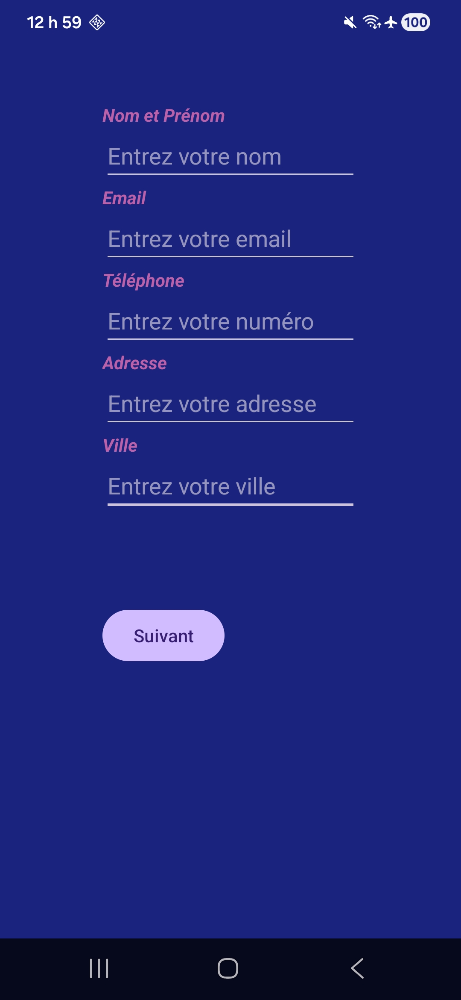
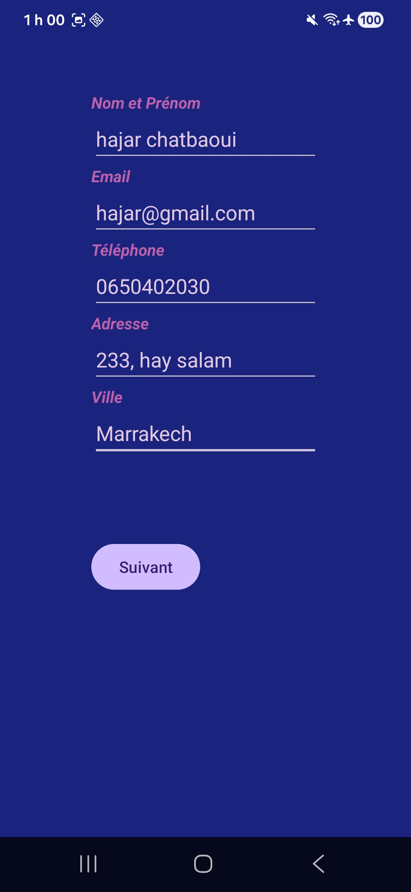

# lab3_JAVA
# Lab 3 - Formulaire et navigation entre activités

Dans ce lab, j'ai créé une application Android en Java avec deux écrans.
Le premier écran contient un formulaire où l'utilisateur saisit son nom,
email, téléphone, adresse et ville. Après avoir cliqué sur "Suivant",
les informations sont envoyées vers un deuxième écran qui affiche un
récapitulatif de toutes les données saisies. Un bouton "Retour au formulaire"
permet de revenir au premier écran.

## Captures d'écran

## Auteur
Hajar Chatbaoui
